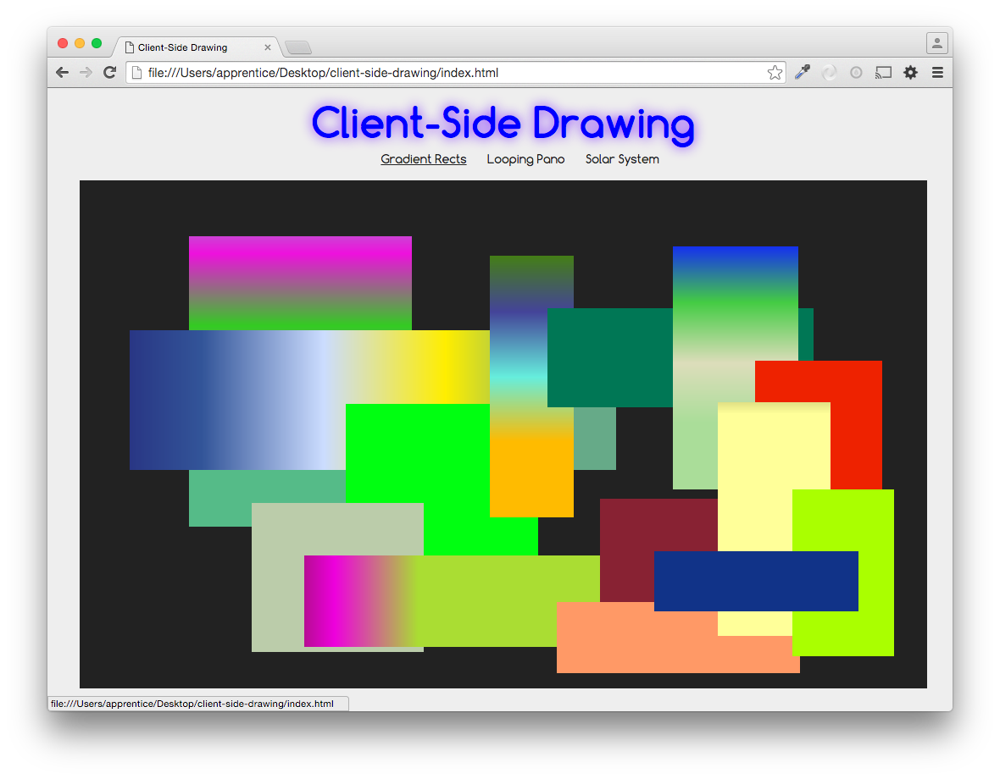

# DBC Thundertalk: Client-Side Drawing

## Gradient Rects

This is an example of drawing rectangles with random color gradients, produced when you click the canvas twice. On the second click, a rectangle will be drawn in the space between your two clicks:

## Looping Pano & Solar System

These two demos are from the [MDN Canvas tutorial](https://developer.mozilla.org/en-US/docs/Web/API/Canvas_API/Tutorial).

## Slides

These are the [Slides](https://docs.google.com/presentation/d/12M2NgjHaJTgWgGb9vvx-msM6fmQa2ek6kU0vMNnNxj4/edit?usp=sharing) for my DBC Thundertalk.
